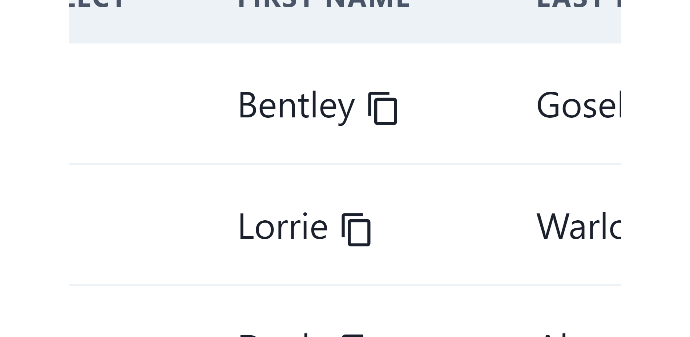
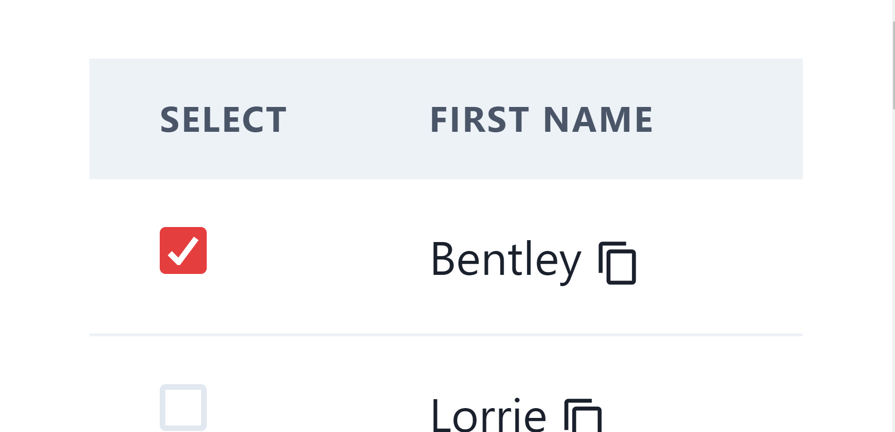
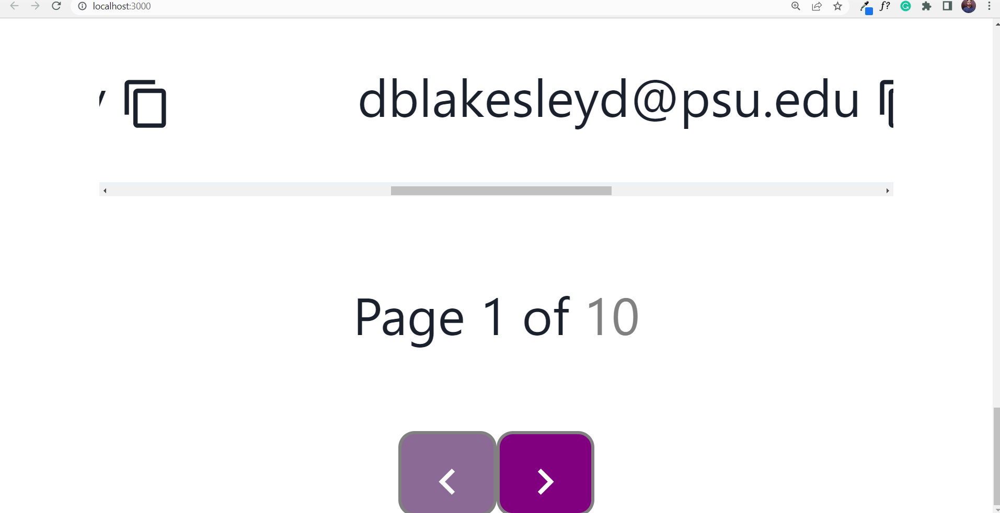

# USER DETAILS

Details of all users in table format.

## Technologies used

- HTML
- Javascript
- CSS
- React
- Chakra UI
- MongoDB Atlas
- NodeJS
- ExpressJS

## Functional things

- Copy any cell value to your clipboard by clicking on COPY icon.
  

- Sort the list by EMAIL and GENDER by clicking on the updown arrow in heading.
  

- Delete any row by clicking on DELETE icon.
  

- Select the row by clicking on Checkbox button.
  

- You can do pagination by clicking on arrow buttons at the bottom.
  

## Author

- [Manish Singh](https://github.com/ManishSingh64)

# DEPLOYMENTS

### `LIVE LINKS`
Frontend deployed on NETLIFY.
[LIVE](https://rhombuz.netlify.app)
### `NOTE` Render deployment is free, so it will take approx 20 sec to show the data or refresh it again meanwhile you can see the code.
Backend deployed on RENDER

### `URL`
[CLICK TO SEE THE DATA](https://rhombuzdata.onrender.com/user?sortByEmail&sortByGender&page=1&limit=10)
